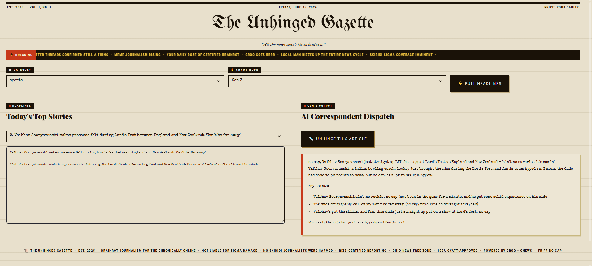

**Unhinged Gazette** is an AI-powered news translator that takes real-world news headlines and rewrites them into Gen Z language, making current events more engaging, relatable, and easier to understand for younger audiences.



Instead of reading:

> "Federal Reserve signals potential monetary policy adjustments."

You might read:

> "The money bosses are thinking about switching things up, so your wallet might feel it soon 💸."

## Why?

Many young people avoid following the news because headlines can feel overly formal, technical, or difficult to understand.

Unhinged Gazette bridges that gap by using AI to transform traditional news into content that feels natural, entertaining, and accessible without losing the core message.

## Features

*  Fetches real news headlines
*  AI-powered Gen Z headline conversion
*  Fast and interactive Streamlit interface
*  Makes complex topics easier to understand
*  Encourages news engagement among younger audiences
*  Secure API key management using environment variables

## Tech Stack

* Python
* Streamlit
* Groq API
* Requests
* Python Dotenv

## Installation

### Clone the repository

```bash
git clone https://github.com/xnsar/unhinged-gazette.git
cd unhinged-gazette
```

### Install dependencies

```bash
pip install -r requirements.txt
```

### Configure Environment Variables

Create a `.env` file:

```env
GROQ_API_KEY=your_api_key_here
```

### Run the Application

```bash
streamlit run main_news.py
```

## Example

### Original Headline

> "Government announces new transportation infrastructure initiative."

### Unhinged Gazette Version

> "The government just dropped a huge public transport update and they're about to spend serious money on it 🚆🔥"

## Future Improvements

* Multiple Gen Z translation styles
* Social media share integration
* Regional slang support
* News category filtering
* AI-generated memes and reactions

## Author

Developed by Mohammed Mujtaba Jafar.

---

**Making the news less boring, one headline at a time.**
